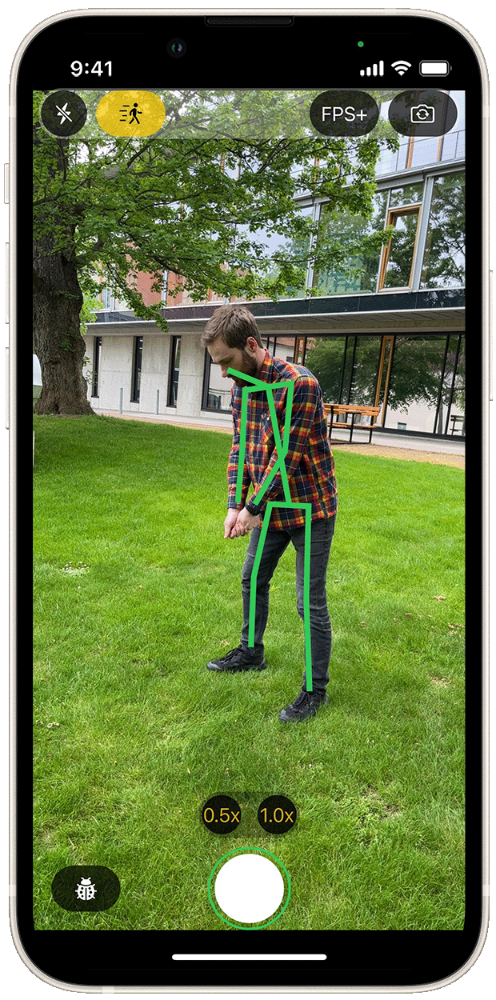
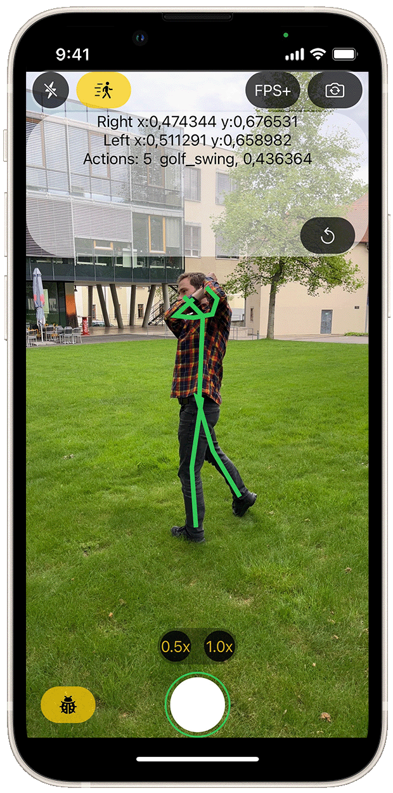

# 🦅 Falconize app (iOS)

|    | version | minimum dev target |
| --- | ------- | --- | 
|  | v1.0 | 16.0 | 

The content of this work is a mobile application for the iOS platform. The application is aimed at athletes, whom it should help during their training, and serves as a tool for automatically recording short snippets of video. The implementation is in Swift using the AVFoundation framework. The application has implemented the human pose detector using the CoreML model and can recognize certain game moments which will be captured. The short video snippet recorded with this application then contains the few seconds that preceded the game moment and also the few seconds that followed.

This app was created as a master's work at the Brno University of Technology (BUT), Faculty of Information Technology in 2023.

## ⚡️Features
- CoreML model for pose rocegnotion
- golf-swing detection
- captures moments before target action
- camera implemented using AVFoundation

## 📱Screenshots
 |   
--- | --- 

## 📕Citation
NÁCAR, Arthur. iOS aplikace pro záznam krátkých sportovních videí [online]. Brno, 2023 [cit. 2023-06-20]. Dostupné z: [https://www.vut.cz/studenti/zav-prace/detail/148759](https://www.vut.cz/studenti/zav-prace/detail/148759). Diplomová práce. Vysoké učení technické v Brně, Fakulta informačních technologií, Ústav počítačové grafiky a multimédií. Vedoucí práce Adam Herout.